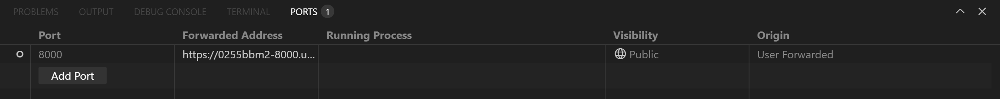

# Backend-App

### install the dependencies of the backend code

> First locate in your shell in the root directory of the project

````bash
pip install -r requirements.txt
````

and execute the code with this command:

````bash
uvicorn main:app --reload
````

For localhost tunnel with cloudfare after running the main:

````bash
winget install -e --id Cloudflare.cloudflared
cloudflared tunnel --url http://localhost:8000

````
NOTE: Public internet in university doesn't allow this, so use mobile data, 
so to use the university's internet you can create a port in vscode with github, and use that address:


